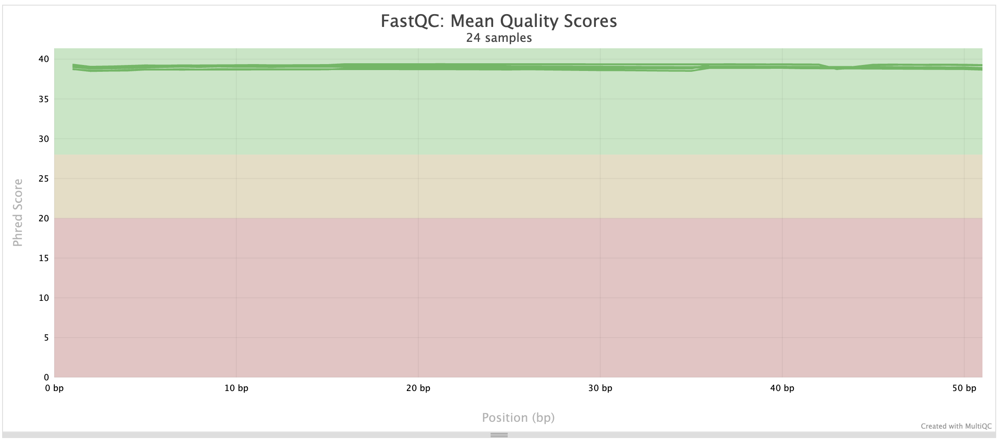

## esults, report # 1: Quantification, DE and GO analysis

Date: October 17, 2025
### Descrition of libraries
Table 1. Samples, number of reads per library and group.

| sample    | reads    | group         |$
|-----------|----------|---------------|$
| F1Stomach | 36701924 | primary_cells |$
| F2Stomach | 46216098 | primary_cells |$
| F3Stomach | 42312543 | primary_cells |$
| F1StMono  | 40928482 | 2D_smallMol   |$
| F2StMono  | 41176172 | 2D_smallMol   |$
| F3StMono  | 39601448 | 2D_smallMol   |$
| F1StHOIH  | 40866240 | 3D_purProt    |$
| F2StHOIH  | 42733329 | 3D_purProt    |$
| F3StHOIH  | 39283229 | 3D_purProt    |$
| F1StNSC   | 42085891 | 3D_smallMol   |$
| F2StNSC   | 33031281 | 3D_smallMol   |$
| F3StNSC   | 39212559 | 3D_smallMol   |$

primary_cells : Mice gastric primary cells cultured with purified stomach groth factors proteins.
2D_smallMol   : Mice gratric cells cultured in Petri dishes supplemented with small molecules growth factors.
3D_purProt    : Organoid culture supplemented with purified stomach groth factors proteins.
3D_smallMol   : Organoid culture supplemented with small molecules growth factors.

### Content
  1. Quality control
  2. Quantification
  3. Differential expression analysis
  4. Gene ontology analysis

#### Quality control
Because the quality of libraries is very high (typical of 50 cycles libraries), no quality trimming was required.

  

