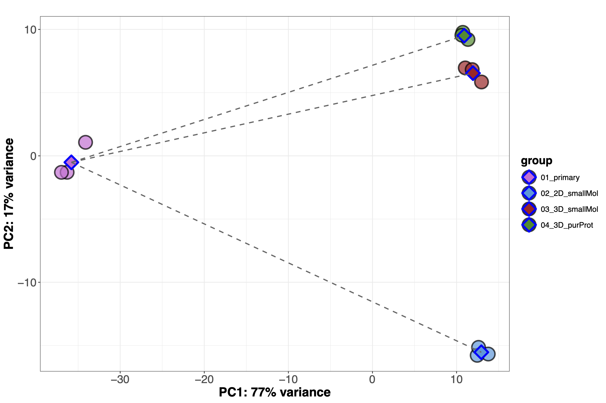
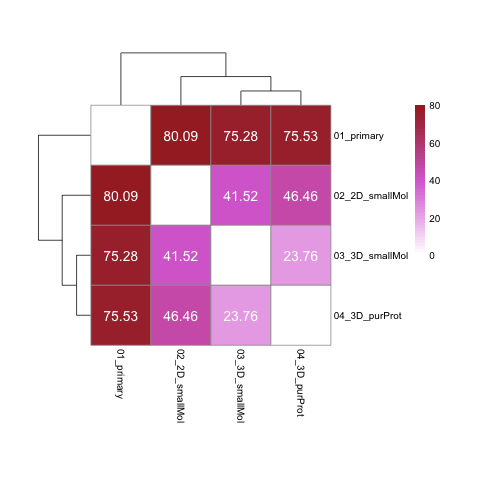

## Results, report # 1: Quantification, DE and GO analysis

Date: October 17, 2025
### Descrition of libraries
Table 1. Samples, number of reads per library and group.

| sample    | reads    | group         |
|-----------|----------|---------------|
| F1Stomach | 36701924 | primary_cells |
| F2Stomach | 46216098 | primary_cells |
| F3Stomach | 42312543 | primary_cells |
| F1StMono  | 40928482 | 2D_smallMol   |
| F2StMono  | 41176172 | 2D_smallMol   |
| F3StMono  | 39601448 | 2D_smallMol   |
| F1StHOIH  | 40866240 | 3D_purProt    |
| F2StHOIH  | 42733329 | 3D_purProt    |
| F3StHOIH  | 39283229 | 3D_purProt    |
| F1StNSC   | 42085891 | 3D_smallMol   |
| F2StNSC   | 33031281 | 3D_smallMol   |
| F3StNSC   | 39212559 | 3D_smallMol   |

**Groups:**<br>
  primary_cells : Mice gastric primary cells cultured with purified stomach groth factors proteins.<br>
  2D_smallMol   : Mice gratric cells cultured in Petri dishes supplemented with small molecules growth factors.<br>
  3D_purProt    : Organoid culture supplemented with purified stomach groth factors proteins.<br>
  3D_smallMol   : Organoid culture supplemented with small molecules growth factors.<br>

### Content
  1. Quality control
  2. Quantification
  3. Differential expression analysis
  4. Gene ontology analysis

#### Quality control
Because the quality of libraries is very high (typical of 50 cycles libraries), no quality trimming was required.

**Figure 1.** Quality scores (Q) for all libraries, including end1 and end2.<br> 
<div align="center">
  
</div>

#### Quantification
Quantification was performed with Salmon, against the mouse transcriptome GRCm39, with the following command:
```bash
  salmon quant \
    -i $DIR/$TRANSCRIPTOME_IDX \
    -l A \
    -1 $READ1 \
    -2 $READ2 \
    -o $OUTPUT_DIR \
    --validateMappings \
    --gcBias \
    --seqBias \
    -p 24
```

##### Distance analysis at the full transcriptome level

The transcriptome is very sensitive to environmental alterations. In order to assess which culture (2D_smallMol, 3D_smallMol, or 3D_purProt) transcriptome is closer to the transcriptome of primary cells, a series of analyses were conducted.

**Principal Component Analysis**

Euclidean distances of vst data were used to derived principal components. Component 1 and 2 are presented in the following figure. Centroids for each cluster are included.

**Figure 2.** PCA for all samples using Euclidean distances and including the centroid for each cluster. 

<div align="center">
  
</div>

Table 2. Distances between centroids

| group          |  01_primary | 02_2D_smallMol | 03_3D_smallMol | 04_3D_purProt |
|----------------|--------------|----------------|---------------|---------------|
| 01_primary     |      0.00    |      80.09     |     75.28     |    75.53      |
| 02_2D_smallMol | <u>80.09</u> |       0.00     |     41.52     |    46.46      |
| 03_3D_smallMol | <u>75.28</u> |   <u>41.52</u> |      0.00     |    23.76      |
| 04_3D_purProt  | <u>75.53</u> |   <u>46.46</u> |  <u>23.76</u> |     0.00      |

**Figure 3.** Heatmap of distances between group centroids.

<div align="center">
  
</div>


#### Differential expression analysis

The following metadata table was used for differential expression analysis and downstream analysis.

Table 2. Metadata
| sampleID   | group            | label  |
|------------|------------------|--------|
| F1Stomach  | 01_primary       | F1pri  |
| F1StMono   | 02_2D_smallMol   | F12D   |
| F1StHOIH   | 04_3D_purProt    | F13Dpp |
| F1StNSC    | 03_3D_smallMol   | F13Dsm |
| F2Stomach  | 01_primary       | F2pri  |
| F2StMono   | 02_2D_smallMol   | F22D   |
| F2StHOIH   | 04_3D_purProt    | F23Dpp |
| F2StNSC    | 03_3D_smallMol   | F23Dsm |
| F3Stomach  | 01_primary       | F3pri  |
| F3StMono   | 02_2D_smallMol   | F32D   |
| F3StHOIH   | 04_3D_purProt    | F33Dpp |
| F3StNSC    | 03_3D_smallMol   | F33Dsm |

