## Results, report # 1: Quantification, DE and GO analysis

Date: October 17, 2025
### Description of libraries
Table 1. Samples, number of reads per library and group.

| sample    | reads    | group         |
|-----------|----------|---------------|
| F1Stomach | 36701924 | primary_cells |
| F2Stomach | 46216098 | primary_cells |
| F3Stomach | 42312543 | primary_cells |
| F1StMono  | 40928482 | 2D_smallMol   |
| F2StMono  | 41176172 | 2D_smallMol   |
| F3StMono  | 39601448 | 2D_smallMol   |
| F1StHOIH  | 40866240 | 3D_purProt    |
| F2StHOIH  | 42733329 | 3D_purProt    |
| F3StHOIH  | 39283229 | 3D_purProt    |
| F1StNSC   | 42085891 | 3D_smallMol   |
| F2StNSC   | 33031281 | 3D_smallMol   |
| F3StNSC   | 39212559 | 3D_smallMol   |

**Groups:**<br>
  primary_cells : Mice gastric primary cells cultured with purified stomach growth factors proteins (baseline/reference condition).<br>
  2D_smallMol   : Mice gastric cells cultured in Petri dishes (2D monolayer) supplemented with small molecules growth factors.<br>
  3D_purProt    : 3D organoid culture supplemented with purified stomach growth factors proteins.<br>
  3D_smallMol   : 3D organoid culture supplemented with small molecules growth factors.<br>

### Content
  1. Quality control
  2. Quantification
  3. Differential expression analysis
  4. Gene ontology analysis

#### Quality control
Quality assessment was performed using FastQC and MultiQC. The libraries demonstrated excellent quality with typical Q scores above 30 throughout the read length (typical of 50-cycle libraries), indicating high sequence confidence. Based on the quality metrics, no quality trimming or additional preprocessing was required before quantification.

**Figure 1.** Quality scores (Q) for all libraries, including end1 and end2.<br> 
<div align="center">
  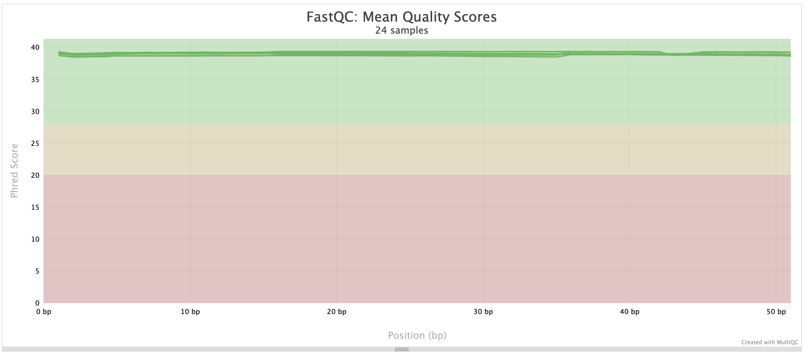
</div>

#### Quantification
Transcript abundance quantification was performed using Salmon (version 1.4.0) against the mouse reference transcriptome GRCm39. Salmon was chosen for its superior accuracy in transcript-level quantification and its ability to account for various biases. The quantification included bias correction for GC content and sequence bias to improve accuracy.
```bash
  salmon quant \
    -i $DIR/$TRANSCRIPTOME_IDX \
    -l A \
    -1 $READ1 \
    -2 $READ2 \
    -o $OUTPUT_DIR \
    --validateMappings \
    --gcBias \
    --seqBias \
    -p 24
```

##### Distance analysis at the full transcriptome level

The transcriptome is very sensitive to environmental alterations. In order to assess which culture (2D_smallMol, 3D_smallMol, or 3D_purProt) transcriptome is closer to the transcriptome of primary cells, a series of analyses were conducted.

**Principal Component Analysis**

Principal Component Analysis (PCA) was performed using variance-stabilizing transformed (VST) data from DESeq2 to normalize count distributions and reduce heteroscedasticity. Euclidean distances were used to derive principal components, with the first two components capturing the main sources of variation between experimental conditions. Centroids for each group are included to facilitate distance calculations between conditions.

**Figure 2.** PCA for all samples using Euclidean distances and including the centroid for each cluster. 

<div align="center">
  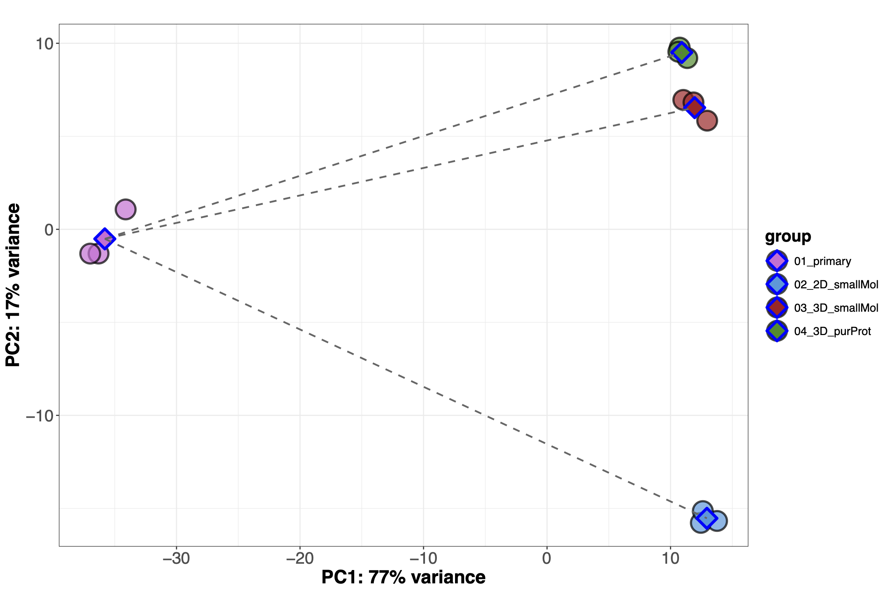
</div>

Table 2. Distances between centroids

| group          |  01_primary | 02_2D_smallMol | 03_3D_smallMol | 04_3D_purProt |
|----------------|--------------|----------------|---------------|---------------|
| 01_primary     |      0.00    |      80.09     |     75.28     |    75.53      |
| 02_2D_smallMol | <u>80.09</u> |       0.00     |     41.52     |    46.46      |
| 03_3D_smallMol | <u>75.28</u> |   <u>41.52</u> |      0.00     |    23.76      |
| 04_3D_purProt  | <u>75.53</u> |   <u>46.46</u> |  <u>23.76</u> |     0.00      |

**Figure 3.** Heatmap of distances between group centroids.

<div align="center">
  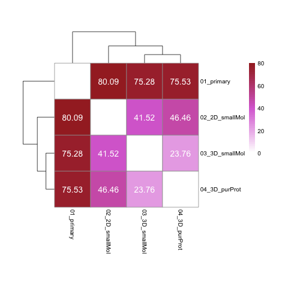
</div>

Another approach to assess transcriptome similarity is to calculate Pearson correlation coefficients for the expression of all transcripts in pairwise comparisons between groups. This analysis was performed on regularized log-transformed data to ensure proper normalization and to assess the overall correlation structure between experimental conditions.

**Figure 4.** Heatmap showing Pearson correlation coefficients between the expression of all transcripts in pairwise comparisons (data subjected to a regularized logarithmic transformation).

<div align="center">
  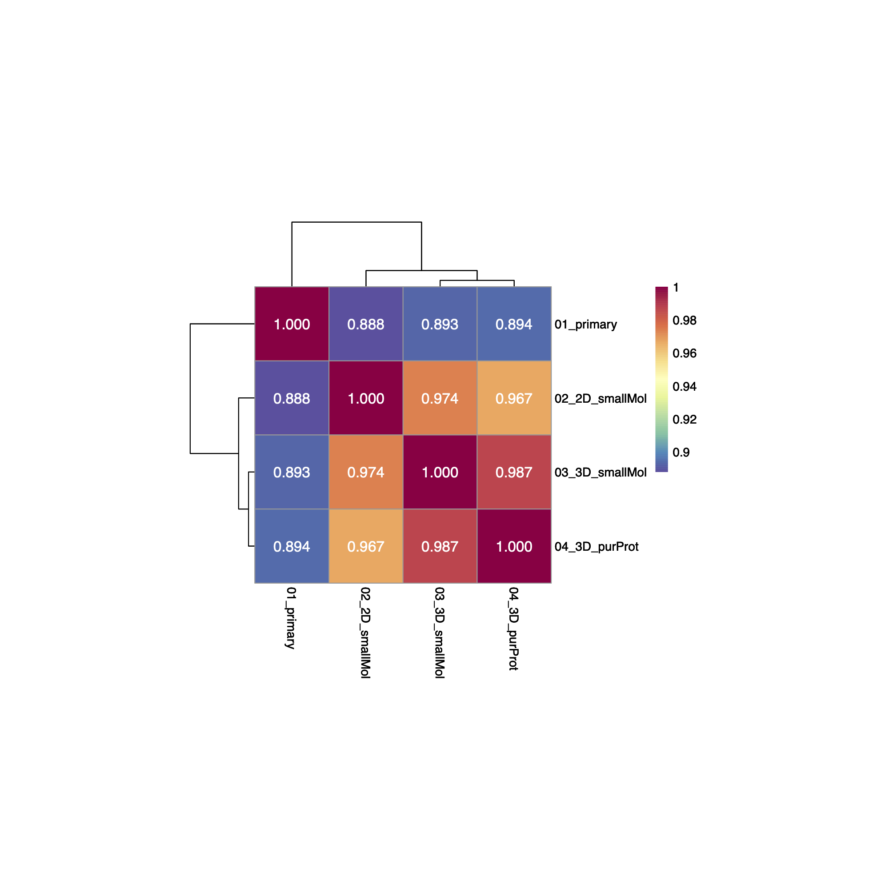
</div>

📝 When using the whole transcriptome, what we see is that the three experimental cultures transcriptome is very different from the one in primary cells, and much closer among them. Namely, in PC units (useful only as relative distances), we see that the 2D culture centroid is positioned ~80 units away from the primary cells centroid, while both 3D groups centroids locate ~75 units. Also, the distance among the two 3D cultures is approximately half of the distance between them and the 2D culture.

📋 In summary, the 2D and 3D cultures transcriptomes are substantially different from the one in primary cells. The 3D cultures transcriptome is slightly more similar to the primary cells than the 2D culture. Both 3D cultures locate close to each other, which means that the dimensionality (2D vs 3D) of cultures, is much more determinant than the source of growth factors.
  
#### Differential expression analysis

The following metadata table was used for differential expression analysis and downstream analysis.

Table 3. Metadata.

| sampleID   | group            | label  |
|------------|------------------|--------|
| F1Stomach  | 01_primary       | F1pri  |
| F1StMono   | 02_2D_smallMol   | F12D   |
| F1StHOIH   | 04_3D_purProt    | F13Dpp |
| F1StNSC    | 03_3D_smallMol   | F13Dsm |
| F2Stomach  | 01_primary       | F2pri  |
| F2StMono   | 02_2D_smallMol   | F22D   |
| F2StHOIH   | 04_3D_purProt    | F23Dpp |
| F2StNSC    | 03_3D_smallMol   | F23Dsm |
| F3Stomach  | 01_primary       | F3pri  |
| F3StMono   | 02_2D_smallMol   | F32D   |
| F3StHOIH   | 04_3D_purProt    | F33Dpp |
| F3StNSC    | 03_3D_smallMol   | F33Dsm |

Differential expression analysis was conducted using DESeq2 to identify genes with statistically significant changes in expression between experimental conditions. Primary cells were set as the reference condition for all comparisons. Count data were filtered to include only genes with at least 5 reads in at least 3 samples to reduce noise from lowly expressed genes. Statistical significance was assessed using the Wald test with multiple testing correction (Benjamini-Hochberg, padj < 0.05) and effect size threshold (|log2FoldChange| ≥ 1). The analysis utilized the apeglm shrinkage method for log2 fold change estimation to reduce noise in fold change estimates for low-count genes.

1. primary vs 2D_smallMol -> primary_vs_2D_q0.05_FC1_annotated.xlsx
2. primary vs 3D_purProt  -> primary_vs_3Dpp_q0.05_FC1_annotated.xlsx
3. primary vs 3D_smallMol -> primary_vs_3Dsm_q0.05_FC1_annotated.xlsx

Results for each comparison are briefly describe hereafter:

**primary vs 2D_smallMol**

When transcript expression in primary cells was compared against group 2D_smallMol, 19045 transcripts were found differentially expressed (adjusted pValue < 0.05 and |log2FC| > 1). Out of those, 8833 transcripts were found upregulated (with expression values higher than primary cells), and 10212 transcripts were found downregulated (with expression lower than the primary cells).

**Figure 5.** Volcano plot showing deregulated transcripts between primary and 2D_smallMol cells. Red dots indicate upregulated transcripts and green dots represent downregulated transcripts. 

<div align="center">
  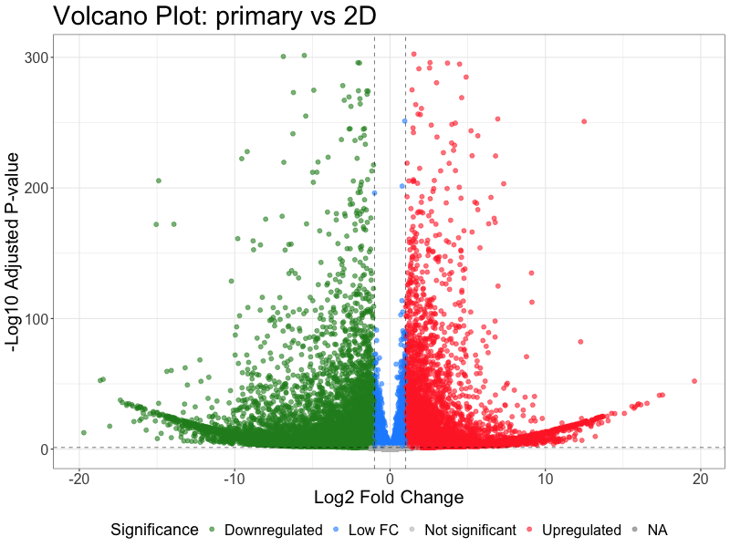
</div>

**primary vs 3D_purProt**

When transcript expression in primary cells was compared against group 3D_purProt, 18998 transcripts were found differentially expressed (adjusted pValue < 0.05 and |log2FC| > 1). Out of those, 9681 transcripts were found upregulated (with expression values higher than primary cells), and 9317 transcripts were found downregulated (with expression lower than the primary cells).

**Figure 6.** Volcano plot showing deregulated transcripts between primary and 3D_purProt cells. Red dots indicate upregulated transcripts and green dots represent downregulated transcripts.

<div align="center">
  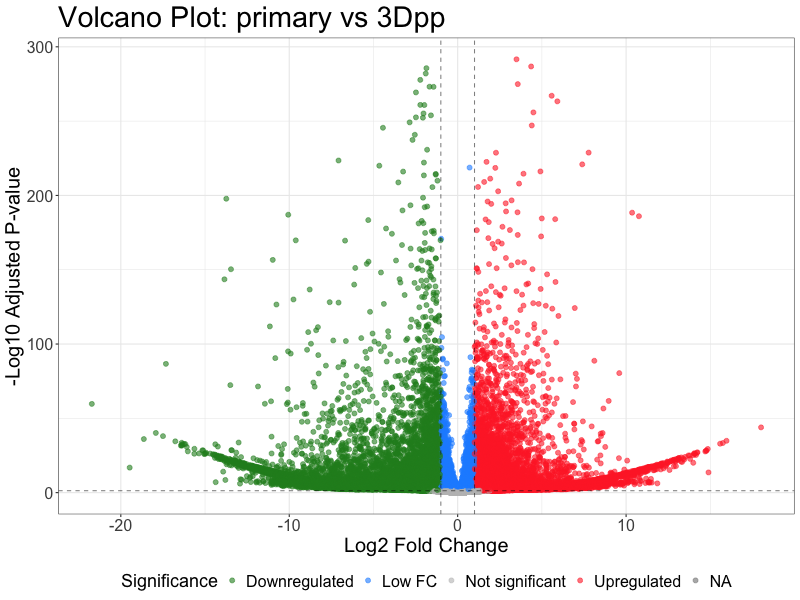
</div>

**primary vs 3D_smallMol**

When transcript expression in primary cells was compared against group 3D_smallMol, 18239 transcripts were found differentially expressed (adjusted pValue < 0.05 and |log2FC| > 1). Out of those, 8838 transcripts were found upregulated (with expression values higher than primary cells), and 9401 transcripts were found downregulated (with expression lower than the primary cells).

**Figure 7.** Volcano plot showing deregulated transcripts between primary and 3D_smallMol cells. Red dots indicate upregulated transcripts and green dots represent downregulated transcripts.

<div align="center">
  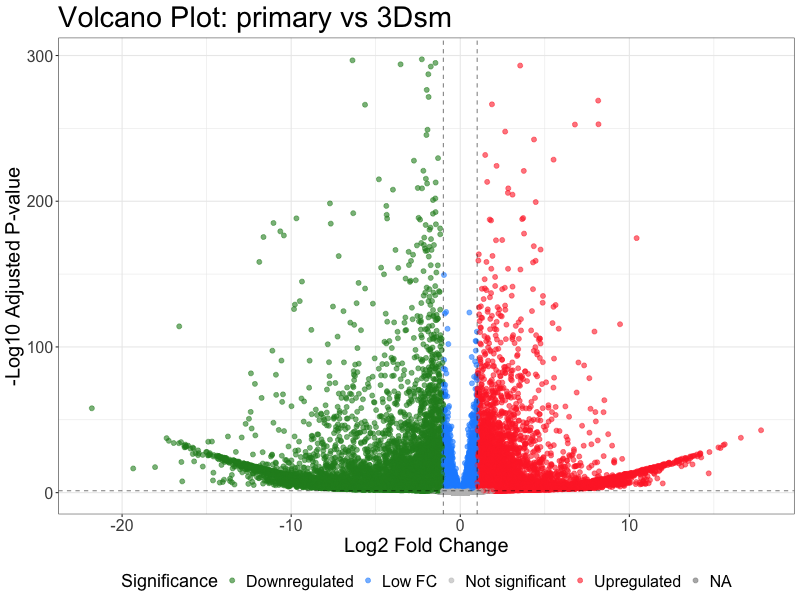
</div>

The number of DE transcripts varied across comparisons: primary vs 2D_smallMol (19,045 transcripts), primary vs 3D_purProt (18,998 transcripts), and primary vs 3D_smallMol (18,239 transcripts), with the 2D_smallMol comparison showing the most changes.

Based on these results, we conclude that the 3D_smallMol culture contains a transcriptome with the smallest number of DE transcripts when compared to primary cells (18,239 vs 19,045 for 2D_smallMol and 18,998 for 3D_purProt), suggesting that this culture condition may be most similar to the primary cell transcriptome.

Another interesting question here is how those DE transcripts in each comparison overlap. This can be depicted in a UpSet plot.

**Figure 8.** UpSet plot showing the number of DE transcripts unique to each of the comparison or overlapping in two or more comparisons. Upper panel with vertical bars in red represent upregulated transcripts while lower panel, with green vertical bars corresponds to downregulated transcripts. 

<div align="center">
  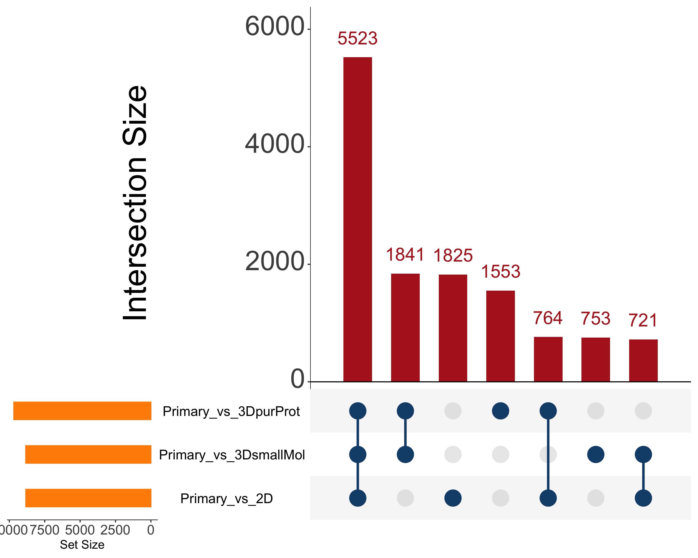
</div>
<div align="center">
  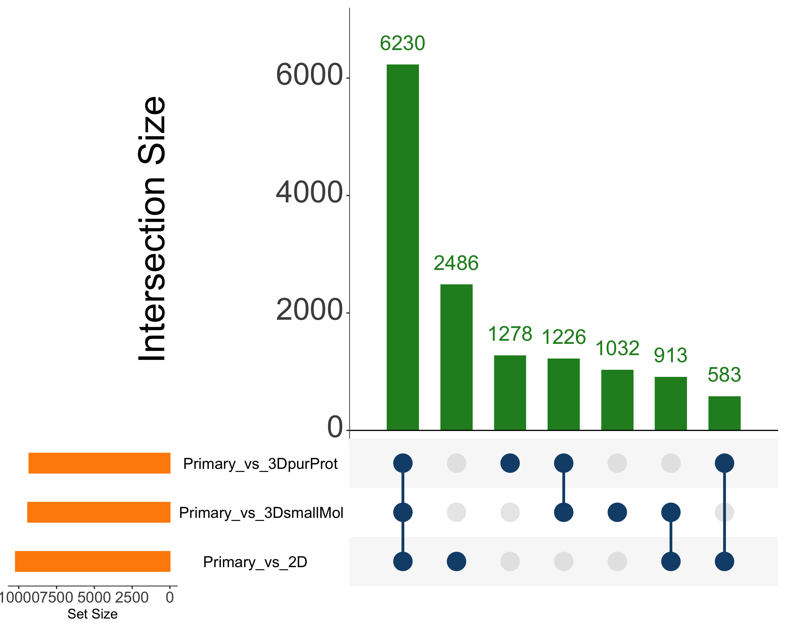
</div>

The UpSet plot analysis reveals important insights into the overlap of differentially expressed genes across culture conditions. Approximately half of the DE transcripts were common to all three comparisons, indicating a core set of genes consistently affected when moving from primary cells to cultured conditions. A relatively large fraction of transcripts (1,885 upregulated and 2,486 downregulated) were found deregulated only in 2D_smallMol cultures, likely representing specific adaptations to the 2D monolayer environment. Both 3D cultures also shared substantial numbers of unique DE transcripts, suggesting common responses to 3D culture conditions. Interestingly, each 3D culture condition (3D_purProt and 3D_smallMol) also exhibited their own unique sets of DE transcripts, indicating that the type of growth factors (purified proteins vs small molecules) has distinct effects on gene expression in 3D organoid cultures.

#### Gene ontology analysis

Functional interpretation of differentially expressed transcripts was performed using gene set enrichment analysis (GSEA) and over-representation analysis (ORA) to identify biological processes and pathways affected by the different culture conditions. These analyses help understand the biological significance of the observed expression changes beyond individual gene-level differences.

The following analyses were conducted using the R package ClusterProfiler:

1. **Over-representation Analysis (ORA)**: Traditional enrichment analysis was performed on upregulated and downregulated gene sets separately using enriched GO terms (Biological Process) and KEGG pathways. Only significantly differentially expressed genes (padj < 0.05 and |log2FC| ≥ 1) were included in these analyses.

2. **Gene Set Enrichment Analysis (GSEA)**: GSEA was performed using all significantly differentially expressed genes ranked by their log2 fold changes, allowing for detection of more subtle but coordinated changes in gene sets that might be missed by traditional over-representation analysis.

3. **Database Annotation**: All transcripts were annotated using the Ensembl database (GRCm39) to obtain gene symbols, Entrez IDs, GO terms, and pathway information necessary for functional analysis. 

What follows are the top ontology terms or KEGG pathways for each of the comparisons. All differentially enriched or depleted features can be found in the following tables.

1. primary vs 2D_smallMol:<br>
primary_vs_2D_down_GO_enrichment.xlsx: Complete list of enriched Gene Ontology (Biological Process) terms for downregulated transcripts, including GO ID, description, p-value, adjusted p-value, gene counts, and associated gene symbols.<br>
primary_vs_2D_down_KEGG_enrichment.xlsx: KEGG pathway enrichment results for downregulated transcripts, showing pathway IDs, pathway names, enrichment statistics, and contributing genes.<br>
primary_vs_2D_GSEA_GO_results.xlsx: Gene Set Enrichment Analysis results for GO Biological Process gene sets, ranked by expression correlation with primary vs 2D_smallMol comparison, including normalized enrichment scores and significance.<br>
primary_vs_2D_q0.05_FC1_annotated.xlsx: Complete annotated list of all significantly differentially expressed transcripts (adjusted p-value < 0.05, |log2FC| ≥ 1) with gene symbols, descriptions, fold changes, and statistical measures.<br>
primary_vs_2D_up_GO_enrichment.xlsx: Enriched Gene Ontology (Biological Process) terms for upregulated transcripts with detailed statistics, gene counts per term, and full gene annotations.<br>
primary_vs_2D_up_KEGG_enrichment.xlsx: KEGG pathway enrichment analysis results for upregulated transcripts, including pathway descriptions and statistical significance measures.
  
2. primary vs 3D_purProt:<br>
primary_vs_3Dpp_down_GO_enrichment.xlsx: Enriched Gene Ontology (Biological Process) terms for downregulated transcripts in 3D organoid cultures with purified proteins, containing GO term descriptions, enrichment statistics, and gene lists.<br>
primary_vs_3Dpp_down_KEGG_enrichment.xlsx: KEGG pathway enrichment results for downregulated transcripts in 3D_purProt comparison, displaying affected metabolic and signaling pathways with statistical significance.<br>
primary_vs_3Dpp_GSEA_GO_results.xlsx: Gene Set Enrichment Analysis results for GO terms comparing primary cells vs 3D organoids with purified proteins, showing pathway-level expression changes and enrichment scores.<br>
primary_vs_3Dpp_q0.05_FC1_annotated.xlsx: Comprehensive annotated dataset of significantly differentially expressed transcripts (padj < 0.05, |log2FC| ≥ 1) with complete gene annotations, fold changes, and p-values for primary vs 3D_purProt comparison.<br>
primary_vs_3Dpp_up_GO_enrichment.xlsx: Gene Ontology enrichment analysis results for upregulated transcripts in 3D organoid cultures with purified proteins, including functional categorization and statistical metrics.<br>
primary_vs_3Dpp_up_KEGG_enrichment.xlsx: KEGG pathway analysis for upregulated transcripts in 3D_purProt cultures, identifying activated biological pathways and processes.

3. primary vs 3D_smallMol:<br>
primary_vs_3Dsm_down_GO_enrichment.xlsx: Gene Ontology (Biological Process) enrichment results for downregulated transcripts in 3D organoid cultures with small molecule supplements, featuring detailed GO term annotations and enrichment statistics.<br>
primary_vs_3Dsm_down_KEGG_enrichment.xlsx: KEGG pathway enrichment analysis for downregulated transcripts in 3D_smallMol comparison, showing suppressed pathways with associated genes and statistical metrics.<br>
primary_vs_3Dsm_GSEA_GO_results.xlsx: Gene Set Enrichment Analysis results for GO Biological Process terms in primary vs 3D_smallMol comparison, presenting pathway-level expression signatures and enrichment rankings.<br>
primary_vs_3Dsm_q0.05_FC1_annotated.xlsx: Fully annotated list of significantly differentially expressed transcripts for primary vs 3D_smallMol comparison, including gene symbols, descriptions, log2 fold changes, adjusted p-values, and functional annotations.<br>
primary_vs_3Dsm_up_GO_enrichment.xlsx: Enriched Gene Ontology terms for upregulated transcripts in 3D organoid cultures supplemented with small molecules, containing functional category assignments and gene set statistics.<br>
primary_vs_3Dsm_up_KEGG_enrichment.xlsx: KEGG pathway enrichment results for upregulated transcripts in 3D_smallMol cultures, identifying enhanced metabolic and regulatory pathways associated with small molecule supplementation.

Hereafter the top differentially enriched or depleted features in each comparison:

**Figure 9.** Top enriched gene ontology terms in upregulated DE transcripts for comparison primary versus 2D_smallMol. 
<div align="center">
  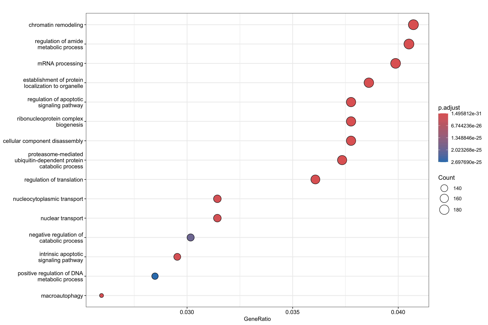
</div>

**Figure 10.** Top enriched gene ontology terms in downregulated DE transcripts for comparison primary versus 2D_smallMol. 
<div align="center">
  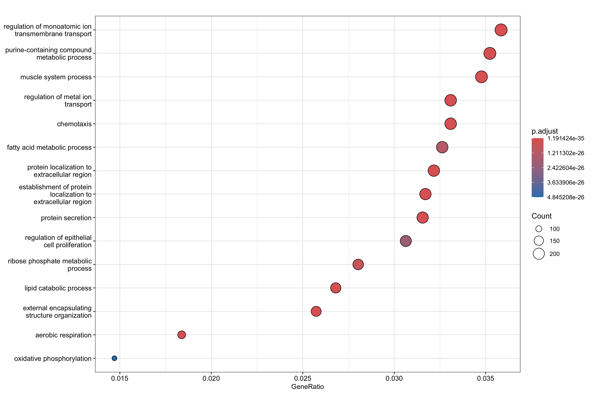
</div>

**Figure 11.** Top enriched gene ontology terms in GSEA for comparison primary versus 2D_smallMol.
<div align="center">
  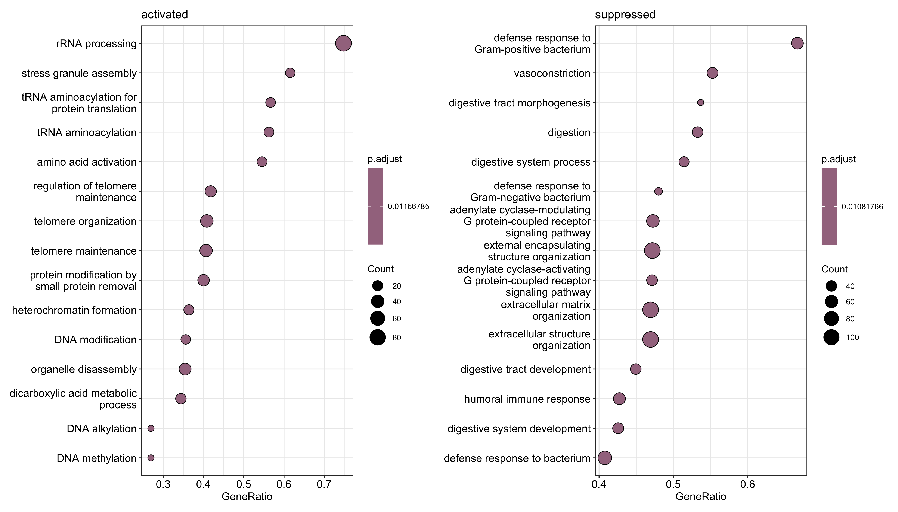
</div>

**Figure 12.** Top enriched gene ontology terms from GSEA KEGG pathways for comparison primary versus 2D_smallMol.
<div align="center">
  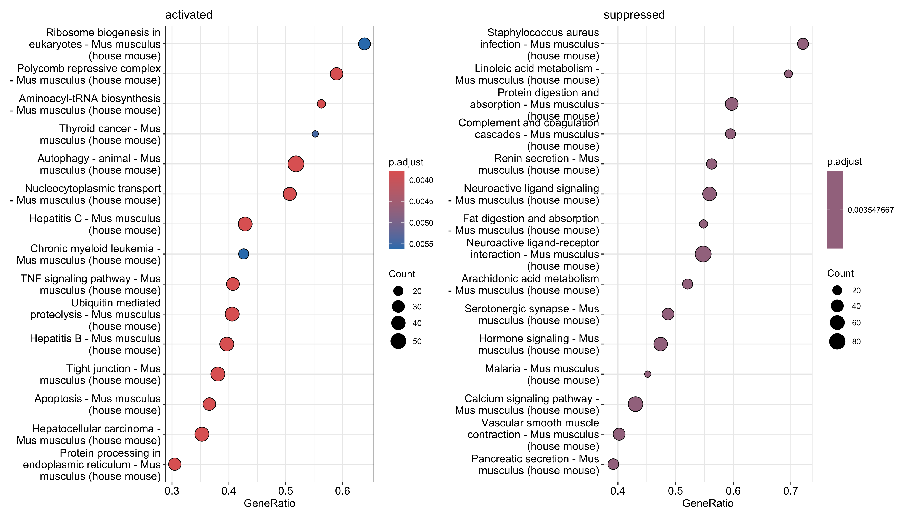
</div>

**primary vs 3D_purProt GO Analysis**

**Figure 13.** Top enriched gene ontology terms in upregulated DE transcripts for comparison primary versus 3D_purProt.
<div align="center">
  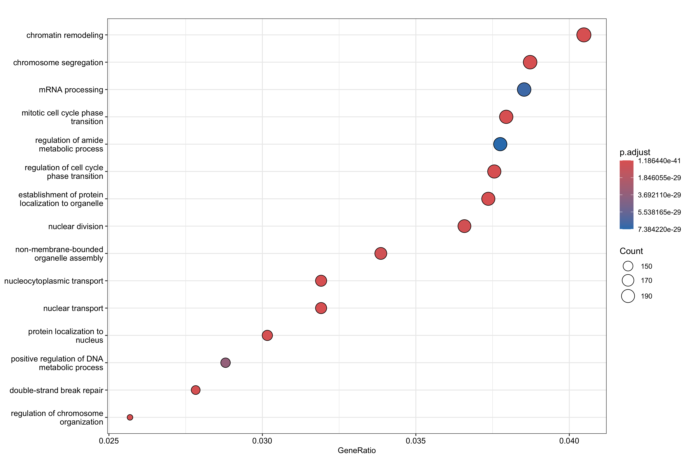
</div>

**Figure 14.** Top enriched gene ontology terms in downregulated DE transcripts for comparison primary versus 3D_purProt.
<div align="center">
  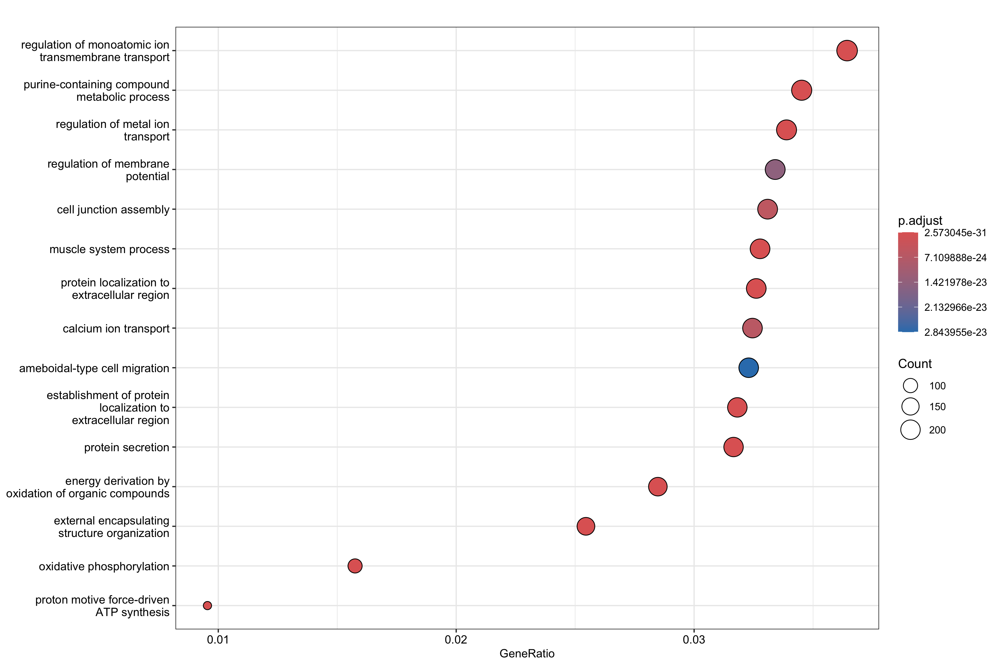
</div>

**Figure 15.** Top enriched gene ontology terms in GSEA for comparison primary versus 3D_purProt.
<div align="center">
  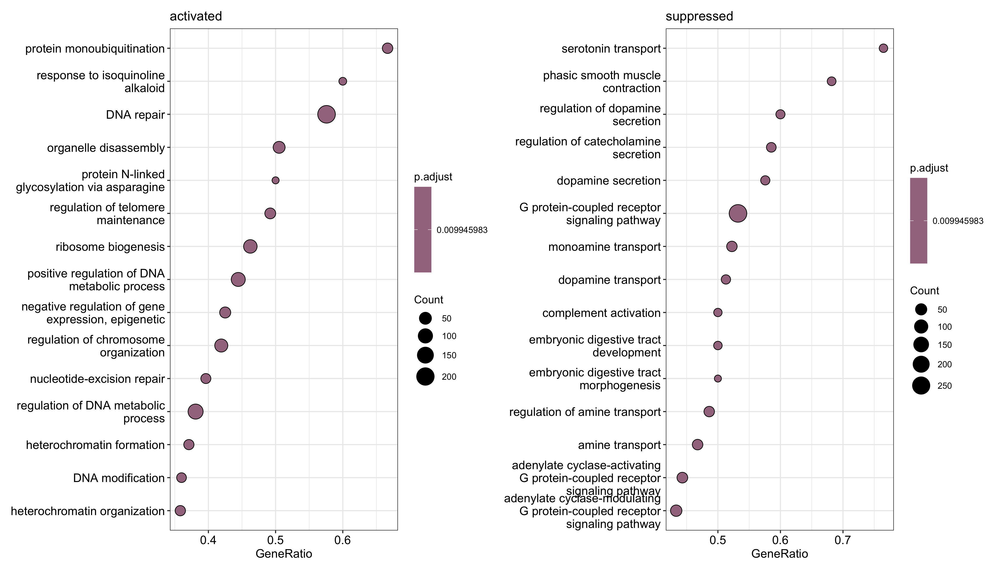
</div>

**Figure 16.** Top enriched gene ontology terms from GSEA KEGG pathways for comparison primary versus 3D_purProt.
<div align="center">
  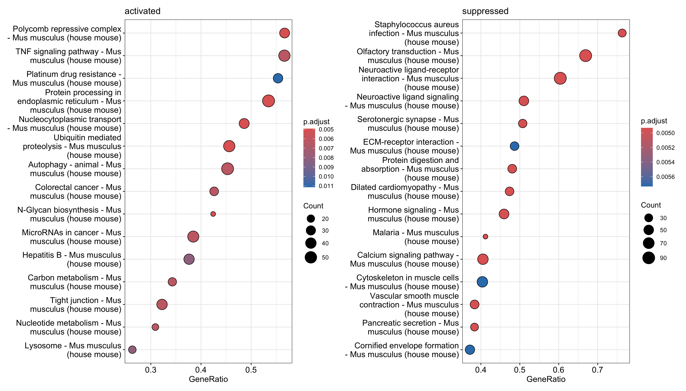
</div>

**primary vs 3D_smallMol GO Analysis**

**Figure 17.** Top enriched gene ontology terms in upregulated DE transcripts for comparison primary versus 3D_smallMol.
<div align="center">
  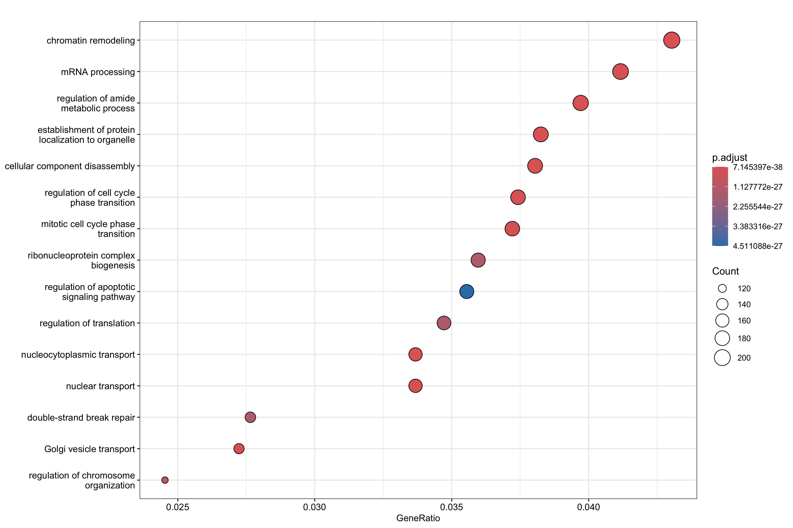
</div>

**Figure 18.** Top enriched gene ontology terms in downregulated DE transcripts for comparison primary versus 3D_smallMol.
<div align="center">
  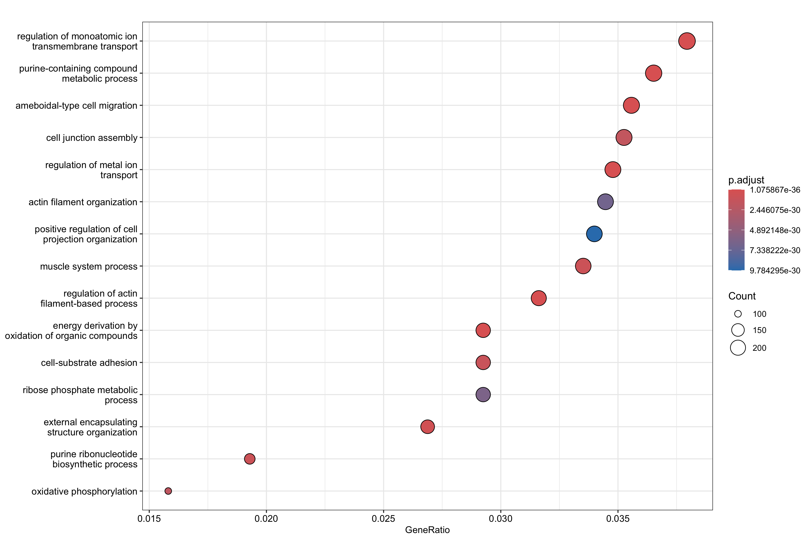
</div>

**Figure 19.** Top enriched gene ontology terms in GSEA for comparison primary versus 3D_smallMol.
<div align="center">
  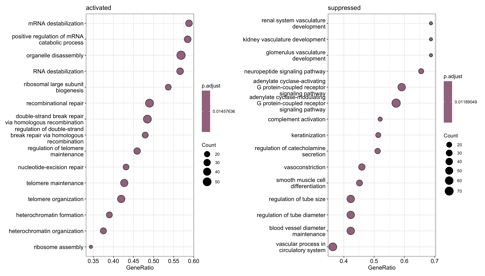
</div>

**Figure 20.** Top enriched gene ontology terms from GSEA KEGG pathways for comparison primary versus 3D_smallMol.
<div align="center">
  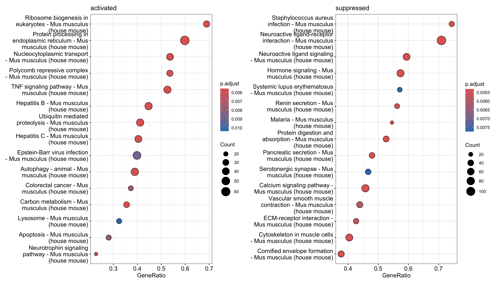
</div>

### Summary and Conclusions

This comprehensive transcriptomic analysis comparing primary gastric cells with different culture conditions (2D monolayer, 3D organoids with purified proteins, and 3D organoids with small molecules) provides several key insights:

**Transcriptome Similarity to Primary Cells:**
- Based on both PCA distance analysis and differential expression results, 3D cultures (particularly 3D_smallMol) show the highest similarity to primary gastric cells
- The 3D_smallMol condition showed the fewest differentially expressed genes when compared to primary cells (18,239 vs 19,045 for 2D_smallMol)
- Dimensionality appears to be a more important factor than growth factor type in determining transcriptome similarity to primary cells

**Global Expression Patterns:**
- All cultured conditions show substantial transcriptomic differences from primary cells, highlighting the impact of in vitro culture
- 2D monolayer cultures show the greatest divergence from primary cells, with many unique differentially expressed genes
- 3D organoid cultures cluster together in PCA space, suggesting shared responses to the 3D environment

**Functional Implications:**
- The gene ontology and pathway analyses (presented in Figures 9-20) reveal the biological processes affected by each culture condition
- These analyses help identify specific cellular functions, developmental pathways, and metabolic processes that are altered during adaptation to different culture environments

The results suggest that 3D organoid cultures, particularly those supplemented with small molecule growth factors, may provide the most physiologically relevant model for studying gastric cell biology in vitro.

---

**NOTE:** This report was generated with AI-assistance, don't use it directly for publication without verifying that everything is correct.
